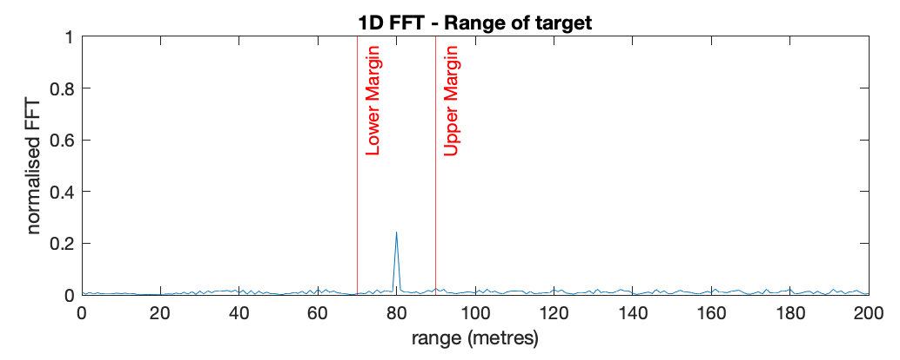
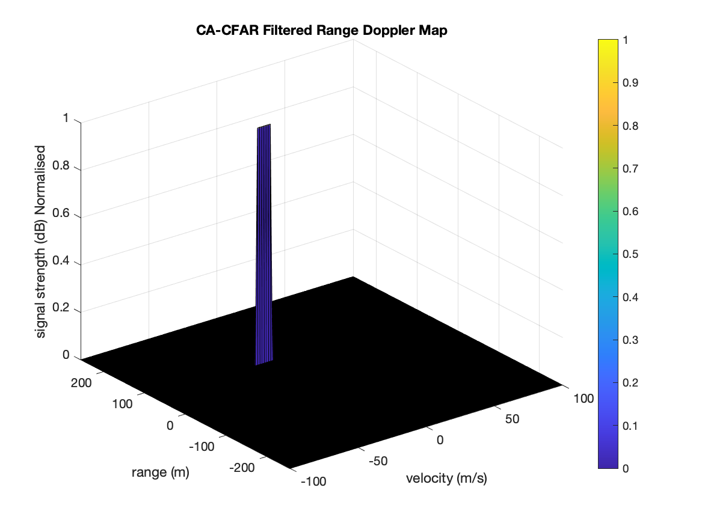
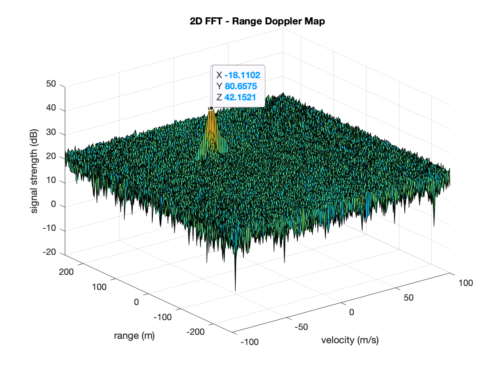

# Sensor Fusion
### Radar Target Generation and Detection Project

## Overview

MATLAB development to implement a pipeline which simulates a noisy Radar waveform using a given radar specification. Fast Fourier Transform (FFT) and 2 Dimension Constant False Alarm Rate (2D CFAR) are used to filter out the noise and extract the range and velocity of the detected targets.

The process to develop:

* Configure the FMCW waveform based on the system requirements.
* Define the range and velocity of target and simulate its displacement.
* For the same simulation loop process the transmit and receive signal to determine the beat signal
* Perform Range FFT on the received signal to determine the Range
* Towards the end, perform the CFAR processing on the output of 2nd FFT to display the target.

---

## Usage

1. Clone repo [SFND_Radar](https://github.com/nutmas/SFND_Radar.git)
2. Launch MATLAB
3. Open script location containing `radarSimulation.m`
4. Run script within MATLAB (Select script and press F5 or Run, or right click->run)

---

## Model Documentation

### FMCW Waveform Design

The following Radar System Requirements are used to configure the Frequency Modulated Continous Wave (FMCW).

|Parameter | Value |
| --- | --- |
|Frequency | 77GHz |
|Range Resolution | 1m |
|Max Range | 200m  |
|Max Velocity | 70 m/s |
|Velocity Resolution | 3 m/s |

Using the parameter specifications, the FMCW waveform design is implemented in:

_Lines 32-41: radarSimulation.m_

The Bandwidth (B), chirp time (Tchirp) and slope of the chirp are established.

The FMCW design produced:

`Chirp Time: 7.33µs`

`Bandwidth: 150MHz`

The criteria for slope calculation is _"around 2e13"_

`slope = 2.0455e+13`

Specifications for the initial range and velocity of the target, and selected value for simulation:

|Parameter | Criteria | Utilised Value|
|:--|:--|:--|
| Initial Target Range | < 200m | __80m__ |
| Initial Target Velocity | +/- 70m/s | __-20m/s__ |

_Lines 21-22: radarSimulation.m_

---

### Simulation Loop

Target movement is simulated and beat signal is calculated for every timestamp.

The signal is prepared in the 'for loop' between lines:

_Lines 69-86: radarSimulation.m_

For each time stamp a transmission signal is constructed based on the radar specifications.
The values defined for initial target and range are also processed and a time delay is determined dependent on time step. This delay time is incorporated into the model to create a time delayed return signal.

_Lines 78-79: radarSimulation.m_

The beat signal is calculated by multiplying the transmit and receive signals.

_Line 84: radarSimulation.m_

---

### Range FFT (1st FFT)

The Range FFT is implemented on the generated beat signal:

_Lines 90-121: radarSimulation.m_

* 1D FFT Process implemented on the Beat Signal
- Reshape the vector into Nr*Nd array.
    + _Line 94: radarSimulation.m_
- Run the FFT on the beat signal.
    + _Line 97: radarSimulation.m_
- Normalise the FFT output.
    + _Line 100: radarSimulation.m_
- Take the absolute value.
    + _Line 100: radarSimulation.m_
- Keep one half of the signal
    + _Line 105: radarSimulation.m_
- Plot the output with a peak at the initial position of target.
    + + _Lines 109-121: radarSimulation.m_

Implement the Range FFT on the Beat or Mixed Signal and plot the result.

The error margin of +/- 10 metres is indicated in red on the plot. The simulation generates a peak at the initial position of the target within this error margin.

---

### 2D CFAR

The CFAR is implemented: 

_Lines 184-264: radarSimulation.m_

* 2d CFAR Process implemented on the Beat Signal
- Determine training cells and guard cells for each dimension.
    + _Lines 166-172: radarSimulation.m_
    + _Lines 195-197: radarSimulation.m_
- Slide the cell under test across the complete matrix.
    + _Lines 204-238: radarSimulation.m_
- Set CUT margin for training and guard cells from edges
    + _Lines 211-213: radarSimulation.m_
- Convert value from logarithmic to linear using db2pow function.
    + _Line 216: radarSimulation.m_
- Sum the signal level within all the training cells. 
    + _Line 219: radarSimulation.m_
- Average the summed values for all of the training cells.
    + _Line 219: radarSimulation.m_
- Convert back to logarithmic using pow2db.
    + _Line 222: radarSimulation.m_
- Add the offset to it to determine the threshold.
    + _Line 228: radarSimulation.m_
- Compare the signal under CUT against this threshold.
    + _Lines 231-236: radarSimulation.m_
- If the CUT level > threshold assign it a value of 1, else equate it to 0.
    + _Lines 231-232: radarSimulation.m_
    + _Line 200: radarSimulation.m_

The 2D CFAR processing has suppressed the noise to show a clear separation of the target signal.

---

## Reflection

### Range Doppler Response

The Range Doppler Response output from the 2D FFT is show below:

A point near the peak of the response is selected which shows
`X: -18.11 (velocity m/s)` 
`Y: 80.66 (range m)` 

The values can be compared with the specifications for the initial range and velocity of the target and indicate the accuracy of this implementation.

---

## License

For License information please see the [LICENSE](./LICENSE) file for details

---

